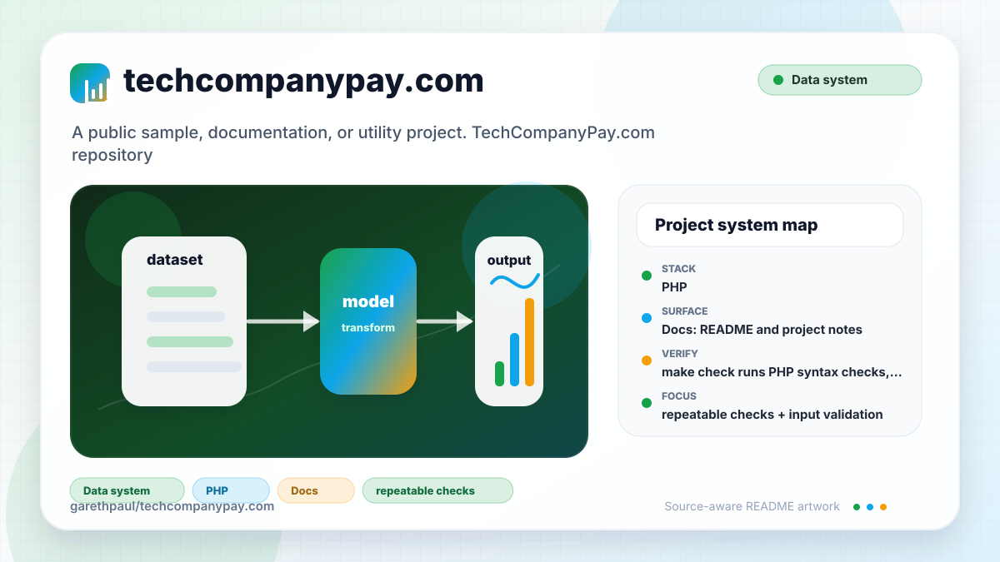

# techcompanypay.com

<!-- README-OVERVIEW-IMAGE -->


## Overview

`garethpaul/techcompanypay.com` is an archived salary-search prototype for
technology companies and locations. It preserves the original PHP demo while
keeping its public-data disclaimer and legacy deployment constraints explicit.

The maintained surface uses PHP, repository-owned JavaScript and CSS, shell
verification, and PHP contract tests.

## Repository Contents

- `README.md` - project overview and local usage notes
- `CHANGES.md` - maintenance history for PHP safety checks
- `Makefile` - local verification entry points
- `.gitignore` - local secret, dependency, log, and editor metadata ignores
- `TODO` - legacy deployment and product notes
- `assets` - repository-owned browser JavaScript and responsive styles
- `docs/plans` - completed maintenance plans for the current baseline
- `find.php` - legacy search endpoint
- `index.php` - search page and sharing metadata
- `plans` - historical implementation notes
- `SECURITY.md` - security reporting and disclosure guidance
- `scripts/check-baseline.sh` - repository maintenance baseline guard
- `tests` - PHP syntax and output behavior checks
- `VISION.md` - project direction and maintenance guardrails

Additional scan context:

- Source directories: `assets`, `scripts`, and `tests`
- Dependency and build manifests: none detected
- Entry points: `index.php` and `find.php`
- Verification surface: `Makefile`, `scripts/check-baseline.sh`, and `tests/*.php`

## Getting Started

### Prerequisites

- Git
- PHP CLI for local syntax and output checks
- Node.js 24 for parity with hosted JavaScript verification
- PHP 8.2, 8.4, or 8.5 for parity with hosted verification

### Setup

```bash
git clone https://github.com/garethpaul/techcompanypay.com.git
cd techcompanypay.com
```

## Running or Using the Project

- Start a local server with `php -S 127.0.0.1:8000`, then open
  `http://127.0.0.1:8000/`.
- `find.php` is the legacy search endpoint. Its PDO prepared statement boundary
  reads `TCP_DB_DSN`, `TCP_DB_USER`, and `TCP_DB_PASSWORD` from the environment
  before any database access. It accepts only POST requests; other methods fail
  before configuration or database creation with HTTP 405 and the existing
  generic response. Bounded incremental PDO result rows prevent a
  query from materializing an unbounded result set before rendering. A bounded encoded database result response also rejects a combined title/group payload
  above 256 KiB before any table output is emitted.
- The search form submits directly to `find.php` without JavaScript and uses a
  bounded same-origin asynchronous request only when `fetch`, URL encoding,
  abort, and byte measurement support are all available. Async results must be
  `text/html` and no larger than the 256 KiB UTF-8 byte response limit before
  DOM insertion. A strict Content-Length preflight rejects declared oversized
  responses before body reads, while measured bytes remain authoritative. The
  live results region exposes its busy state while the latest async request is
  active. Other browsers keep native submission.
- When `TCP_CANONICAL_URL` is configured with a controlled absolute HTTP(S)
  application URL, shared URLs preserve company-only, city-only, or combined
  filters and automatically run either kind of prefilled search in supported
  browsers. Unconfigured or invalid canonical URLs omit `og:url` metadata.

## Testing and Verification

- `make check` runs PHP syntax checks, query-escaping output tests,
  scalar-safe query input checks, and a fail-closed check for the unconfigured
  legacy search endpoint. It also validates the local browser script with Node
  and executes dependency-free search behavior coverage for fallback,
  missing abort support, failures, input bounds, bounded HTML responses, and
  out-of-order response and busy-state ownership.
  Static contracts enforce local assets, CSP, and CI workflow boundaries.
- `make root-test` exercises repository-root, shell, Make metadata, trusted
  PHP/Node tool-value, and non-executing-mode authority without a database.
- Query-string values rendered into the page or share metadata are bounded
  before escaping so long reflected inputs do not expand the response.
- Search endpoint checks also require non-scalar POST fields to normalize to
  empty strings before legacy query handling.
- Search endpoint checks also require database salary values to be formatted
  only after numeric and finite-value validation, with invalid or overflowed
  values displayed as `$0`.
- Search endpoint checks require the PDO prepared statement boundary to use
  exception mode, associative rows, native prepares, and named `term`/`city`
  parameters without a live database driver. They also require a positive row
  budget, incremental associative fetches, exact-limit success, and generic
  failure without partial output when a result set exceeds the budget.
- `make check` also verifies that PHP entry points keep basic response security
  headers, including frame denial and a deny-by-default browser permissions
  policy for camera, microphone, and geolocation. The header checks also require
  a Content-Security-Policy that limits executable scripts and styles to
  repository-owned same-origin assets.
- `scripts/check-baseline.sh` checks required project files, completed
  docs-plan metadata, verification documentation, and local secret/editor
  metadata hygiene.
- `make check` rejects obsolete or remote runtime scripts plus
  protocol-relative and insecure external asset references.
- `make check` also requires completed canonical plans under `docs/plans`.
- GitHub Actions runs the same `make check` gate on fixed Ubuntu 24.04 runners
  with Node 24 and PHP 8.2, 8.4, and 8.5, read-only permissions, bounded jobs,
  concurrency cancellation, immutable action pins, credential-free checkout,
  and one reviewed workflow file.
- Narrow targets are available as `make lint`, `make test`, `make build`, and
  `make verify`.

The browser search can be exercised without database credentials; the
unconfigured endpoint intentionally returns `No matches!`.

## Configuration and Secrets

- Live result queries require `TCP_DB_DSN`, `TCP_DB_USER`, and
  `TCP_DB_PASSWORD` in the process environment. Keep real values in a local
  secret manager; do not commit credentials.
- Optional share metadata reads `TCP_CANONICAL_URL` from the environment. Use
  only an application URL you control; credentials, query strings, fragments,
  non-HTTP(S) schemes, and malformed URLs are rejected.

## Security and Privacy Notes

- Review changes touching network requests, sockets, or service endpoints; examples from the scan include find.php, index.php.
- Review changes touching file, media, JSON, XML, CSV, OCR, or data parsing; examples from the scan include index.php.
- Review changes touching database, model, or persistence code; examples from the scan include find.php.

## Maintenance Notes

- See `SECURITY.md` for vulnerability reporting and safe research guidance.
- See `VISION.md` for project direction and contribution guardrails.
- See `docs/plans/2026-06-08-techcompanypay-baseline.md` for the canonical PHP
  search safety baseline.
- See `docs/plans/2026-06-08-response-security-headers.md` for the response
  header guard.
- See `docs/plans/2026-06-09-frame-options-header.md` for the frame-deny
  response header guard.
- See `docs/plans/2026-06-09-permissions-policy-header.md` for the browser
  permissions policy guard.
- See `docs/plans/2026-06-09-content-security-policy-header.md` for the
  Content-Security-Policy response header guard.
- See `docs/plans/2026-06-09-scalar-query-inputs.md` for the scalar query
  normalization guard.
- See `docs/plans/2026-06-09-query-length-guard.md` for the bounded query
  string input guard.
- See `docs/plans/2026-06-09-scalar-post-inputs.md` for the scalar search POST
  normalization guard.
- See `docs/plans/2026-06-09-salary-format-guard.md` for the salary output
  formatting guard.
- See `docs/plans/2026-06-08-explicit-https-assets.md` for the external asset
  URL guard.
- See `docs/plans/2026-06-09-scripted-baseline-check.md` for the scripted
  repository baseline guard and local secret/editor metadata ignores.
- See `docs/plans/2026-06-10-local-search-and-ci.md` for the self-contained
  browser runtime, progressive form fallback, and stricter script policy.
- See `docs/plans/2026-06-10-city-only-share-links.md` for independent share
  filter encoding and city-only search bootstrap coverage.
- See `docs/plans/2026-06-13-search-results-busy-state.md` for the async live
  region busy-state contract.
- See `docs/plans/2026-06-14-make-root-override-protection.md` for authoritative
  repository-root selection across all Make aliases.
- See `docs/plans/2026-06-21-make-authority-isolation.md` for quoted checkout
  paths, fixed shell authority, Make mode rejection, and startup boundaries.
- See `docs/plans/2026-06-25-finite-salary-format.md` for overflow-safe salary
  conversion and non-finite value regressions.
- See `docs/plans/2026-06-14-utf8-search-response-byte-limit.md` for the
  byte-accurate asynchronous HTML response boundary.
- See `docs/plans/2026-06-14-search-content-length-preflight.md` for early
  rejection of declared oversized asynchronous responses.
- See `docs/plans/2026-06-15-pdo-database-boundary.md` for the PHP 8-compatible
  connection and parameterized execution contract.
- See `docs/plans/2026-06-17-bounded-pdo-result-rows.md` for the bounded
  incremental PDO result rows and overflow failure contract.
- See `docs/plans/2026-06-17-bounded-encoded-result-response.md` for the shared
  byte-accurate title/group response budget and fail-closed output contract.
- The title and group SQL statements remain intentionally blank because the
  historical schema is absent. A revival must document that schema and add
  reviewed prepared queries before adding real credentials or data.

## Contributing

Keep changes small and tied to the project that is already present in this repository. For code changes, document the toolchain used, avoid committing generated dependency directories or local configuration, and update this README when setup or verification steps change.
